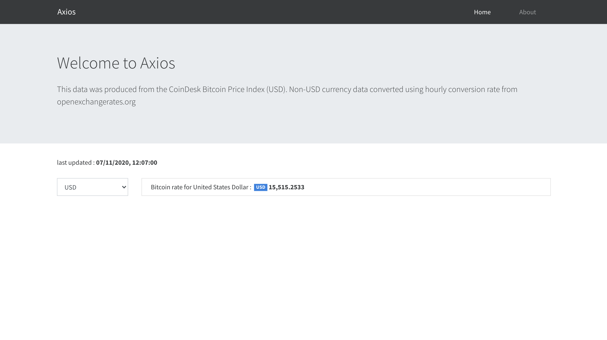

## Next Js 101 ⛳️

This repository contains example projects created while learning Next js. These are not production ready & only serve as reference. Please feel free to contribute.


### Projects ⚓️

1. [Next Js Handbook](https://www.freecodecamp.org/news/the-next-js-handbook/) - [code](https://github.com/kanadkat-asp/learn-nextjs/tree/master/01-nextjs-handbook)
2. [Next Js CrashCourse](https://youtu.be/IkOVe40Sy0U) - [code](https://github.com/kanadkat-asp/learn-nextjs/tree/master/02-nextjs-crashcourse)


### Running Projects ⚙️

The only requirement is Node Js installed (v10+ LTS). Below steps will launch projects on [http://localhost:3000](http://localhost:3000) by default.

1. Open project root directory in terminal (path containg package.json)
2. Install all project dependencies ```npm i```
3. Running project ```npm run dev```

Other scripts `build` & `start` helps during deploying Next Js project.


### From Next JS Crashcourse


